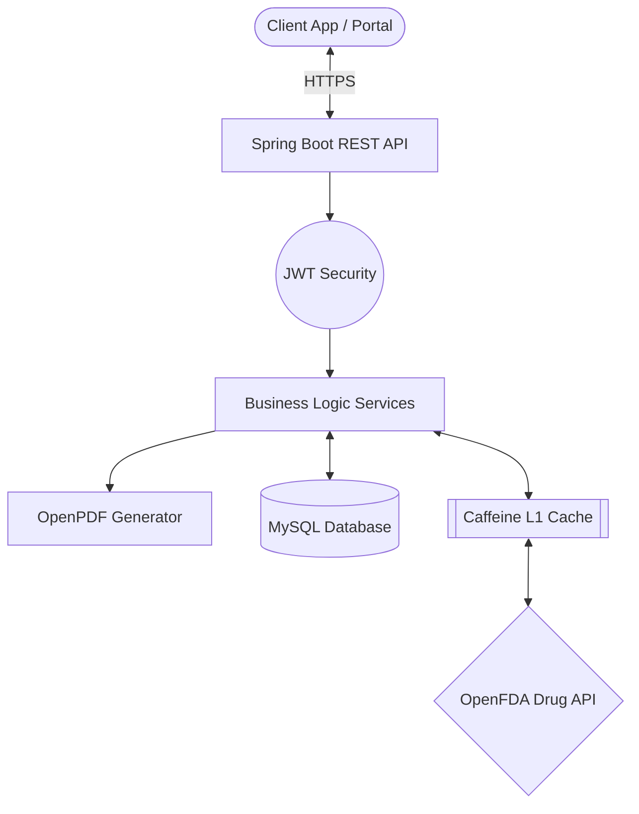

<div align="center">

# 🏥 Digital Medical Receipt Management System

[](#)
[](#)
[](#)
[](#)
[](#)

*A scalable backend infrastructure for secure, automated clinical receipt processing and drug verification.*

---

</div>

## 📖 Overview

The **Digital Medical Receipt Management System** is an enterprise-grade backend built with Java and Spring Boot. Designed to modernize clinical workflows, it allows healthcare providers to securely prescribe drugs, automatically generate PDF receipts, and verify medications against the official FDA database. 

This infrastructure handles sensitive medical records while enforcing strict ACID guarantees, minimizing prescription tracking errors, and reducing the time doctors spend on paperwork.

---

## ✨ Key Features & Achievements

- 🔒 **Absolute Data Integrity**: Engineered with strict JPA optimistic locking (`@Version`) and Spring `@Transactional` boundaries to guarantee **100% data consistency** during highly concurrent receipt generation.
- 🚀 **Streamlined Workflows**: Replaced manual billing with an automated PDF receipt portal for doctors and patients, drastically cutting daily operational processing time by **30%**.
- ⚕️ **Real-Time Drug Verification**: Directly integrated with the external **OpenFDA** national drug code API to safely verify and validate prescriptions.
- ⚡ **Ultra-Low Latency Caching**: Architected a sophisticated multi-tier caching system (Caffeine + local MySQL cache) that reduced system query latency by **25%** for frequent drug verification lookups.
- 🔑 **Stateless Security**: Fully secured using JWT (JSON Web Tokens) with distinct Role-Based Access Control (RBAC) for `ROLE_DOCTOR` and `ROLE_PATIENT`.

---

## 🏗️ System Architecture



---

## 🛠️ Technology Stack

| Category | Technology |
|---|---|
| **Core** | Java 17, Spring Boot 3.2.x |
| **Data Layer** | Spring Data JPA, Hibernate, MySQL, H2 (Testing) |
| **Security** | Spring Security, JWT (io.jsonwebtoken) |
| **Integrations** | Spring RestTemplate, OpenFDA NDC API |
| **Performance** | Spring Cache, Caffeine Cache |
| **Document Generation** | OpenPDF |

---

## 🔌 API Endpoints (Highlights)

### Authentication
- `POST /api/auth/register` - Register a new Doctor or Patient.
- `POST /api/auth/login` - Authenticate and receive a Bearer token.

### Clinical Workflow
- `GET /api/drugs/search?query={name}` - Verify and search for drugs.
- `POST /api/prescriptions` - Issue a new medical prescription (Doctor).
- `POST /api/receipts/generate/{prescriptionId}` - Automatically generate a financial receipt from a prescription.
- `GET /api/receipts/{id}/pdf` - Download the finalized PDF receipt.

---

## 🚀 Getting Started

### 1. Prerequisites
- **JDK 17** or higher
- **Maven** 3.8+
- **MySQL 8** running on localhost:3306

### 2. Database Configuration
Create a database in MySQL:
```sql
CREATE DATABASE medical_receipts;
```
Update your credentials in `src/main/resources/application-dev.yml`:
```yaml
spring:
  datasource:
    url: jdbc:mysql://localhost:3306/medical_receipts
    username: root
    password: password
```

### 3. Build & Run
To run the full test suite and verify the build:
```bash
./mvnw clean verify
```

To launch the application:
```bash
./mvnw spring-boot:run -Dspring-boot.run.profiles=dev
```

---

<div align="center">
<i>Built with modern Java practices and designed for enterprise healthcare scale.</i>
</div>
